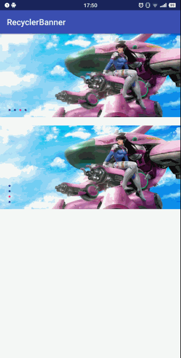

# RecyclerBanner
## 介绍
RecyclerBanner是一个利用RecycleView实现轮播图的自定义控件。效果如下图。

这里有[相关博客介绍！](https://juejin.im/post/5a13a28c51882512a860ee6a)

### 属性

| **属性名称**  | **意义** | **类型** | **默认值** |
| --- | --- | --- | --- |
| app:showIndicator | 是否显示指示器 | boolean | true |
| app:interval | 轮播时间间隔 | int | 4000 |
| app:isAutoPlaying | 是否开启自动轮播 | boolean | true |
| app:orientation | 轮播图方向 | enum | horizontal |
| app:itemSpace | 图片间距 | int | 20 |
| app:centerScale | 当前图片缩放比列 | float | 1.2 |

## License

     Licensed under the Apache License, Version 2.0 (the "License");
     you may not use this file except in compliance with the License.
     You may obtain a copy of the License at

         http://www.apache.org/licenses/LICENSE-2.0

     Unless required by applicable law or agreed to in writing, software
     distributed under the License is distributed on an "AS IS" BASIS,
     WITHOUT WARRANTIES OR CONDITIONS OF ANY KIND, either express or implied.
     See the License for the specific language governing permissions and
     limitations under the License.

