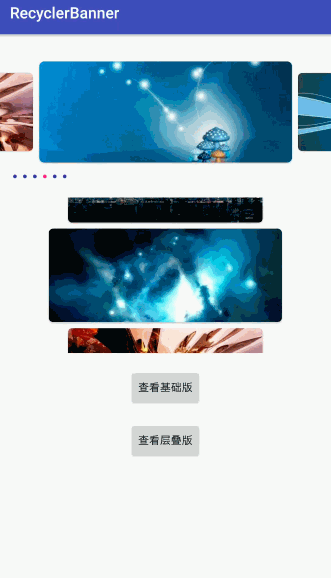

# RecyclerBanner
## 介绍
RecyclerBanner是一个利用RecycleView实现轮播图的自定义控件。

这里有[相关博客介绍！](https://juejin.im/post/5a13a28c51882512a860ee6a)。

## 属性


| **属性名称**  | **方法** | **意义** | **类型** | **默认值** |
| --- | ---| --- | --- | --- |
| app:showIndicator |setShowIndicator(boolean showIndicator)| 是否显示指示器 | boolean | true |
| app:interval |setAutoPlayDuration(int autoPlayDuration)| 轮播时间间隔 | int | 4000 |
| app:isAutoPlaying |setAutoPlaying(boolean isAutoPlaying)| 是否开启自动轮播 | boolean | true |
| app:orientation | setOrientation(int orientation)|轮播图方向 | enum | horizontal |
| app:itemSpace |setItemSpace(int itemSpace) |图片间距 | int | 20 |
| app:centerScale | setCenterScale(float centerScale)|当前图片缩放比列 | float | 1.2 |
| app:moveSpeed | setMoveSpeed(float moveSpeed)|滚动速度，越大越快 | float | 1.0 |

效果如下图：


## 使用方法
设置一个带数据的`RecyclerView.Adapter`即可。
```
   <com.example.library.banner.BannerLayout
        android:id="@+id/recycler"
        android:layout_width="match_parent"
        android:layout_height="200dp"
        app:autoPlaying="true"
        app:centerScale="1.3"
        app:itemSpace="20"
        app:moveSpeed="1.8"/>
```

```

BannerLayout  recyclerBanner =  findViewById(R.id.recycler);
bannerVertical =  findViewById(R.id.recycler_ver);

  List<String> list = new ArrayList<>();
        list.add("http://img0.imgtn.bdimg.com/it/u=1352823040,1166166164&fm=27&gp=0.jpg");
        list.add("http://img3.imgtn.bdimg.com/it/u=2293177440,3125900197&fm=27&gp=0.jpg");
        list.add("http://img3.imgtn.bdimg.com/it/u=3967183915,4078698000&fm=27&gp=0.jpg");
        list.add("http://img0.imgtn.bdimg.com/it/u=3184221534,2238244948&fm=27&gp=0.jpg");
        list.add("http://img4.imgtn.bdimg.com/it/u=1794621527,1964098559&fm=27&gp=0.jpg");
        list.add("http://img4.imgtn.bdimg.com/it/u=1243617734,335916716&fm=27&gp=0.jpg");
WebBannerAdapter webBannerAdapter=new WebBannerAdapter(this,list);
webBannerAdapter.setOnBannerItemClickListener(new BannerLayout.OnBannerItemClickListener() {
            @Override
            public void onItemClick(int position) {
                Toast.makeText(MainActivity.this, "点击了第  " + position+"  项", Toast.LENGTH_SHORT).show();
            }
        });
recyclerBanner.setAdapter(webBannerAdapter);

```

## License


     Licensed under the Apache License, Version 2.0 (the "License");
     you may not use this file except in compliance with the License.
     You may obtain a copy of the License at

         http://www.apache.org/licenses/LICENSE-2.0

     Unless required by applicable law or agreed to in writing, software
     distributed under the License is distributed on an "AS IS" BASIS,
     WITHOUT WARRANTIES OR CONDITIONS OF ANY KIND, either express or implied.
     See the License for the specific language governing permissions and
     limitations under the License.

## 致谢
[ViewPagerLayoutManager](https://github.com/leochuan/ViewPagerLayoutManager) 使用了部分代码


